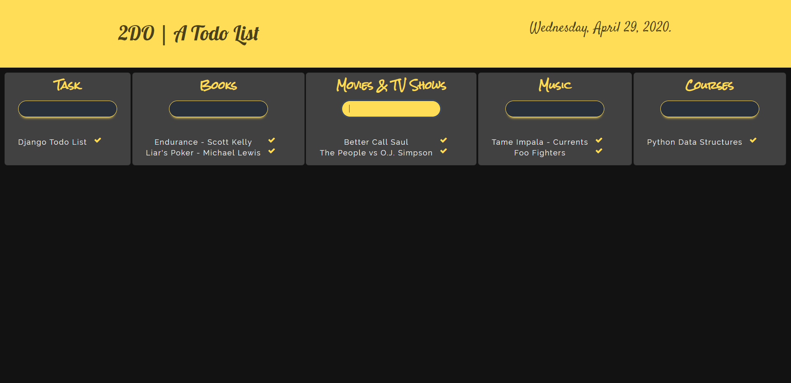

## 2DO | A Todo List
2DO is simple Todo list I made w/ Django v3.0.5. It should work with older versions as well. Uses Django default SQLite3 database. I made a Windows Batch file to start django server directly and open it in Chrome browser window. Made with Bulma and little bit of custom CSS.


  


### Steps to Execute 
#### 1. Git clone 2DO 
```bash
git clone https://github.com/adityaborgaonkar/2DO.git
```
#### 2. cd into 2DO
```bash
cd 2DO
```
#### 6. Migrate Database
```bash
python manage.py makemigrations
python manage.py migrate
```
#### 6. Run 2DO
```bash
python manage.py runserver
```
Go to your browser at http://127.0.0.1:8000


